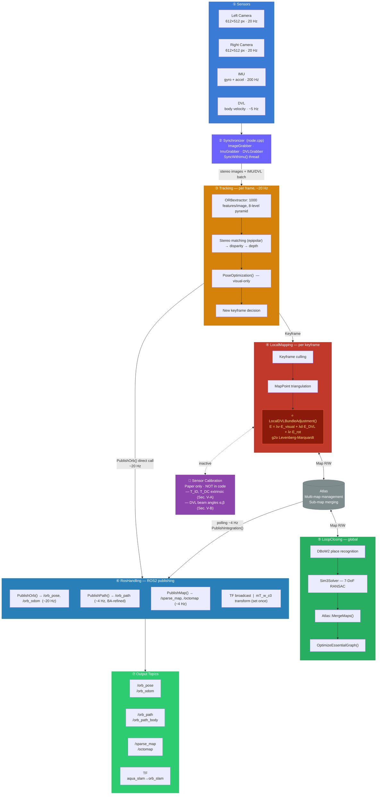

# AQUA-SLAM 아키텍처 문서

> **Tightly-Coupled Underwater Acoustic-Visual-Inertial SLAM**
> Shida Xu, Kaicheng Zhang, Sen Wang — IEEE Transactions on Robotics, 2025
> ROS2 Jazzy / C++17

---

## 1. 시스템 개요

AQUA-SLAM은 수중 자율 주행 로봇을 위한 SLAM 시스템으로, 스테레오 카메라·IMU·DVL(도플러 속도계) 세 센서를 **긴밀하게 결합(tightly-coupled)** 하여 수중 환경에서 강인한 위치 추정과 지도 작성을 수행한다.

ORB-SLAM3을 기반으로 하되, `LocalDVLBundleAdjustment()`를 핵심 혁신으로 추가하여 DVL 속도 측정치와 자이로스코프 회전을 Bundle Adjustment에 직접 통합한다.

### 1.1 지원 하드웨어 및 환경

| 구분 | 구성 |
|------|------|
| 실제 하드웨어 | BlueRobotics Blue ROV + WaterLinked A50 DVL + MicroStrain GX5 IMU |
| 시뮬레이션 | Stonefish 수중 시뮬레이터 (Girona500 모델) |
| 빌드 대상 | ROS2 Jazzy / Ubuntu 24.04 |

---

## 2. 디렉터리 구조

```
aqua_slam_ws/
└── src/AQUA-SLAM/
    ├── include/                    # C++ 헤더
    │   ├── System.h                # 메인 오케스트레이터
    │   ├── Tracking.h              # 프레임 단위 추적
    │   ├── LocalMapping.h          # 키프레임 최적화
    │   ├── LoopClosing.h           # 루프 클로저
    │   ├── Atlas.h                 # 멀티맵 관리
    │   ├── RosHandling.h           # ROS2 인터페이스
    │   ├── DenseMapper.h           # 밀집 포인트 클라우드
    │   ├── Integrator.h            # IMU/DVL 프리인테그레이션
    │   ├── Optimizer.h             # g2o 최적화 백엔드
    │   ├── DVLGroPreIntegration.h  # DVL+자이로 적분
    │   ├── ImuTypes.h              # 센서 데이터 구조체
    │   ├── Frame.h / KeyFrame.h    # 프레임·키프레임
    │   ├── MapPoint.h / Map.h      # 지도 표현
    │   ├── ORBextractor.h          # ORB 특징 추출
    │   ├── ORBmatcher.h            # 특징 매칭
    │   ├── LKTracker.h             # LK 광류 추적기
    │   └── CameraModels/           # Pinhole / KannalaBrandt8
    ├── src/                        # C++ 구현
    ├── launch/                     # ROS2 런치 파일
    ├── data/                       # YAML 설정 파일
    ├── scripts/                    # Python DVL 변환기
    ├── tools/                      # 분석·변환 도구
    ├── Thirdparty/
    │   ├── g2o/                    # 그래프 최적화
    │   ├── DBoW2/                  # BoW 장소 인식
    │   ├── octomap/                # 3D 점유 지도
    │   └── waterlinked_a50_ros_driver/  # DVL 메시지 정의
    ├── Vocabulary/                 # ORB 어휘 파일
    ├── dataset/ / results/
    └── CMakeLists.txt / package.xml
```

---

## 3. 전체 아키텍처 구조도



---

## 4. 주요 컴포넌트 상세

### 4.1 System (오케스트레이터)

`include/System.h` · `src/System.cc`

- 전체 SLAM 파이프라인의 진입점
- 센서 모드: `DVL_STEREO`
- Tracking·LocalMapping·LoopClosing 스레드 생성 및 관리
- `TrackStereoGroDVL()`: 동기화된 이미지+IMU+DVL 처리 진입

### 4.2 Tracking (추적)

`include/Tracking.h` · `src/Tracking.cc`

| 역할 | 설명 |
|------|------|
| ORB 추출 | 좌·우 이미지, 1000개, 8레벨 피라미드 |
| 스테레오 매칭 | SSD 기반, 에피폴라 제약 적용 |
| 포즈 추정 | PoseOptimization() — 시각 전용 |
| 키프레임 결정 | 추적 품질·경과 시간·이동량 기반 |
| 추적 복구 | Relocalization (DBoW2 + PnP) |

### 4.3 LocalMapping (로컬 매핑)

`include/LocalMapping.h` · `src/LocalMapping.cc`

| 역할 | 설명 |
|------|------|
| 키프레임 정제 | 중복 제거(culling), 공간 분포 |
| MapPoint 확장 | 삼각측량으로 신규 포인트 생성 |
| **LocalDVLBA** | DVL+IMU+시각 긴밀 결합 BA |
| DVL 정제 | `LocalDVLRefinement()` — 추적 손실 후 복구 |

### 4.4 LoopClosing (루프 클로저)

`include/LoopClosing.h` · `src/LoopClosing.cc`

- **DBoW2** BoW 벡터 검색으로 장소 인식 후보 획득
- **Sim3Solver** RANSAC으로 기하학적 검증 (7-DoF 변환)
- **OptimizeEssentialGraph()**: 포즈 그래프 전역 최적화
- 다중 서브맵 병합 (`Atlas::MergeMaps()`)

### 4.5 Atlas (멀티맵 관리)

`include/Atlas.h` · `src/Atlas.cc`

- 추적 손실 시 새 `Map` 인스턴스 생성
- 루프 클로저 시 서브맵 병합
- Boost 직렬화로 지도 저장·로드

### 4.6 RosHandling (ROS2 인터페이스)

`include/RosHandling.h` · `src/RosHandling.cpp`

- ORB-SLAM3 내부 좌표를 ROS2 표준 좌표로 변환
- `mT_w_c0`: world←c0 변환 행렬 (중력 정렬, 1회 계산)
- 발행 주기: 포즈 ~20 Hz, 지도/궤적 ~4 Hz

### 4.7 Integrator (프리인테그레이션)

`src/Integrator.h` · `src/Integrator.cpp`

| 적분기 | 설명 |
|--------|------|
| `mpIntFromKF_D2D` | DVL+자이로, 키프레임→현재 (바디 프레임) |
| `mpIntFromKF_C2C` | IMU, 키프레임→현재 (카메라 프레임) |
| `mpIntFromF_C2C` | IMU, 이전 프레임→현재 (추적용) |
| `mpIntFromKFBeforeLost_C2C` | 추적 손실 복구용 |

---

## 5. 센서 데이터 흐름

```
IMU (200 Hz)
 └─ ImuPoint {ax, ay, az, wx, wy, wz, t}
      └─ ImuGrabber::imuBuf
           └─ IMU::Preintegrated (가속도+자이로 적분)
                └─ LocalDVLBundleAdjustment ← E_rot 항

DVL (variable Hz)
 └─ nav_msgs/Odometry {vx, vy, vz, orientation}
      └─ DVLGrabber::dvlBuf
           └─ DVLGroPreIntegration (속도 적분)
                └─ LocalDVLBundleAdjustment ← E_DVL 항

Stereo Images (20 Hz)
 └─ sensor_msgs/Image (left + right)
      └─ ImageGrabber
           └─ ORBextractor → keypoints + descriptors
                └─ Stereo Matching → 깊이(depth)
                     └─ LocalDVLBundleAdjustment ← E_visual 항
```

---

## 6. 토픽 / 서비스 목록

### 발행 토픽

| 토픽 | 타입 | 주기 | 내용 |
|------|------|------|------|
| `/aqua_slam/orb_pose` | PoseStamped | ~20 Hz | 카메라 프레임 포즈 |
| `/aqua_slam/orb_odom` | Odometry | ~20 Hz | 포즈 + DVL/IMU 속도 |
| `/aqua_slam/orb_odom_body` | Odometry | ~20 Hz | 바디(FLU) 프레임 |
| `/aqua_slam/orb_path` | Path | ~4 Hz | BA 정제 키프레임 궤적 |
| `/aqua_slam/orb_path_body` | Path | ~4 Hz | 바디 프레임 궤적 |
| `/aqua_slam/sparse_map` | PointCloud2 | ~4 Hz | 희소 3D 특징 지도 |
| `/aqua_slam/octomap` | Octomap | ~4 Hz | 3D 점유 격자 |
| `/aqua_slam/dvl_imu_path` | Path | ~4 Hz | DVL+IMU 데드레코닝 |
| `/aqua_slam/image/features` | Image | ~20 Hz | ORB 특징 오버레이 |
| `/aqua_slam/markers` | MarkerArray | ~4 Hz | RViz2 시각화 |

### 서비스

| 서비스 | 기능 |
|--------|------|
| `/aqua_slam/save` | 키프레임 궤적 파일 저장 |
| `/aqua_slam/load_map` | 이전 저장 지도 로드 |
| `/aqua_slam/calibrate` | DVL/자이로 바이어스 보정 |
| `/aqua_slam/full_ba` | 전체 Bundle Adjustment 강제 실행 |

---

## 7. 좌표 프레임 계층

```
world (w)
  ← mT_w_c0 (중력 정렬 + 초기 헤딩, 1회 설정)
c0  (ORB-SLAM3 내부 원점 프레임)
  ← T_c0_cj (ORB-SLAM3 출력)
camera (c)  [RDF: X=오른쪽, Y=아래, Z=앞]
  ← T_imu_c (YAML 외부 캘리브레이션)
IMU  (장착 방향 의존)
  ← T_body_imu (YAML, 없으면 항등행렬)
body (b)  [FLU: X=앞, Y=왼쪽, Z=위 — ROS REP-103]

DVL 프레임: FRD (X=앞, Y=오른쪽, Z=아래)
```

---

## 8. 빌드 산출물

```
CMakeLists.txt 빌드 타깃:

libaqua_slam.so              ← 메인 SLAM 라이브러리
  (System, Tracking, LocalMapping, LoopClosing, Frame, KeyFrame,
   MapPoint, Map, Atlas, ORBextractor, ORBmatcher, LKTracker,
   DenseMapper, RosHandling, FrameDrawer, DBoW2, OctoMap)

libaqua_slam_optimization.so ← 최적화 서브라이브러리
  (Optimizer, ImuTypes, DVLGroPreIntegration, OptimizableTypes, g2o)

aqua_slam_node               ← ROS2 실행 파일
  (node.cpp → ImageGrabber/ImuGrabber/DVLGrabber + System)
```

---

## 9. 런치 파일

| 파일 | 환경 | DVL 변환기 |
|------|------|-----------|
| `blue_gx5_StructureEasy.launch.py` | 실제 하드웨어 | `dvl_converter.py` (WaterLinked A50) |
| `stonefish_sim.launch.py` | Stonefish 시뮬레이터 | `sim_dvl_converter.py` (Girona500) |
| `blue_gx5_StructureEasy_record.launch.py` | 데이터 수집 | — |

DVL 변환기 역할: 각 센서 전용 토픽 → `/bluerov2/dvl` (nav_msgs/Odometry) 통일

---

## 10. 서드파티 라이브러리

| 라이브러리 | 버전 | 역할 |
|-----------|------|------|
| **g2o** | 내장 | 그래프 최적화 (BA, 포즈 그래프) |
| **DBoW2** | 내장 | BoW 장소 인식 (루프 클로저) |
| **OctoMap** | 내장 | 3D 점유 격자 지도 |
| **OpenCV** | 4 | 이미지 처리, 특징 추출 |
| **Eigen** | 3.3.4 | 선형대수, 변환 행렬 |
| **PCL** | — | 포인트 클라우드 처리 |
| **Pangolin** | — | SLAM 내부 GUI 시각화 |
| **Boost** | — | 직렬화(지도 저장), 로깅 |

---

## 11. 핵심 혁신 — LocalDVLBundleAdjustment

ORB-SLAM3 표준 BA에 DVL 속도 측정과 자이로스코프 회전을 제약으로 추가한 것이 AQUA-SLAM의 핵심이다.

```
목적 함수:
  E_total = λ_visual · Σ ||π(T_cj · p_i) - u_ij||²
           + λ_DVL   · Σ ||v_dvl - v_integrated||²
           + λ_IMU   · Σ ||R_gyro - R_integrated||²

최적화 변수:
  • T_c0_cj  : 키프레임 포즈 (6-DoF SE3)
  • p_i      : 3D MapPoint 위치
  • v_d      : DVL 속도 (3-DoF, DVL 프레임)
  • b_gyro   : 자이로스코프 바이어스

수중 환경 특성상 시각 특징이 부족할 때 DVL이 스케일과 속도를 안정적으로 제공한다.
```

---

*생성일: 2026-05-30*
